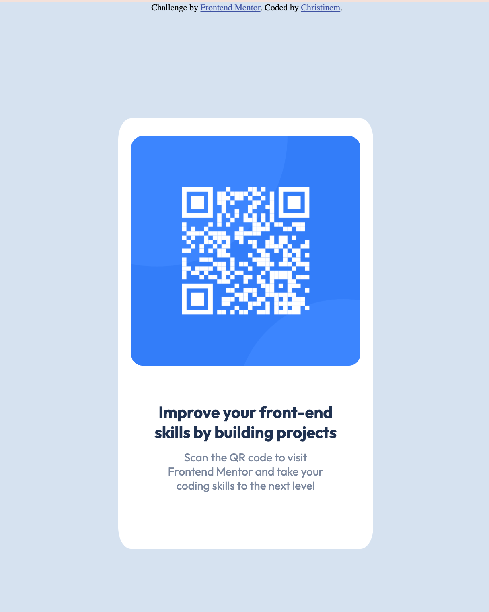

# Frontend Mentor - QR code component solution

This is a solution to the [QR code component challenge on Frontend Mentor](https://www.frontendmentor.io/challenges/qr-code-component-iux_sIO_H). Frontend Mentor challenges help you improve your coding skills by building realistic projects.

## Table of contents

- [Overview](#overview)
  - [Screenshot](#screenshot)

### Screenshot



### Links

Solution is designed for desktops at 1440px and mobile at 375px
- Solution URL: https://replit.com/@christinecvente/frontend-mentor-qr-code#index.html)

## My process

### Built with

- Semantic HTML5 markup
- CSS custom properties
- Mobile-first workflow


To see how you can add code snippets, see below:

```html
<h1>Some HTML code I'm proud of</h1>
```

```css
.proud-of-this-css {
  color: papayawhip;
}
```
